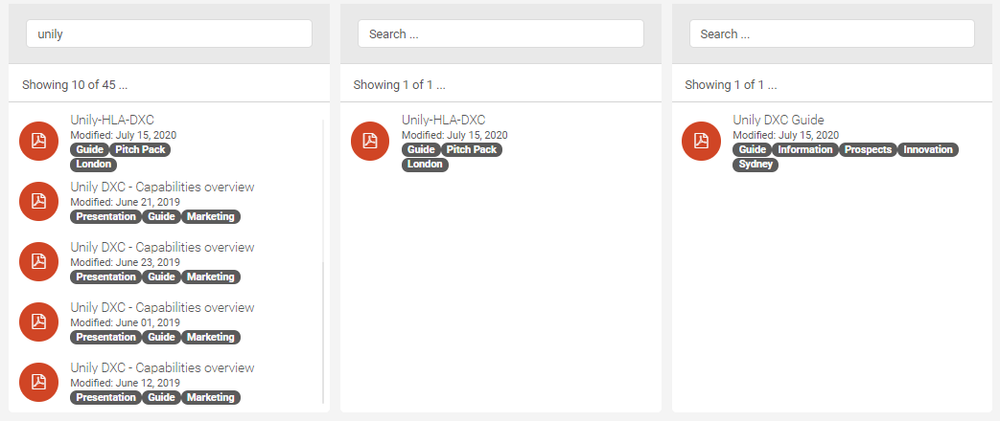

- [Widget GQL Document Search Rollup](#widget-gql-document-search-rollup)
  - [Getting started](#getting-started)

# Widget GQL Document Search Rollup


[Widget Defintion](./markdown/widgetDefinitions.md)

## Getting started

From the console (vscode, cmd prompt, powershell etc type:)

- `> npm install` - update. the node_modules with the required packages for webpack, typescript, typings and dependencies
- `> npm run build:dev` - cleans the compiled folder out
- `> npm run upload` - upload the scripts, content, document types

``` Text
Starting type checking service...
Using 1 worker with 2048MB memory limit

webpack is watching the files…

Type checking in progress...
Hash: 1afd4d9f124ff2a2ccd5
Version: webpack 4.41.2
Time: 1529ms
Built at: 05/05/2020 2:39:39 PM
                                    Asset      Size  Chunks             Chunk Names
      salesforceDataSourceService.dist.js  18.6 KiB       0  [emitted]  salesforceDataSourceService
sharepointSearchDataSourceService.dist.js    47 KiB       1  [emitted]  sharepointSearchDataSourceService
                     zoomWebinars.dist.js  14.6 KiB       2  [emitted]  zoomWebinars
Entrypoint salesforceDataSourceService = salesforceDataSourceService.dist.js
Entrypoint sharepointSearchDataSourceService = sharepointSearchDataSourceService.dist.js
Entrypoint zoomWebinars = zoomWebinars.dist.js
 [0] external "angular" 42 bytes {0} {1} {2} [built]
 [1] ./typescript/datasource/debugLog.ts 884 bytes {0} {1} [built]
 [2] ./typescript/zoom/services/zoomDataServiceBase.ts 6.09 KiB {2} [built]
 [3] ./typescript/datasource/salesforceDataSource.service.entry.ts 648 bytes {0} [built]
 [4] ./typescript/datasource/salesforce/salesforceDataSourceService.service.ts 12.7 KiB {0} [built]
 [5] ./typescript/datasource/sharepointSearchDataSourceService.service.entry.ts 734 bytes {1} [built]
 [6] ./typescript/datasource/sharepoint/sharepointSearchDataSourceService.service.ts 33.2 KiB {1} [built]
 [7] external "_" 42 bytes {1} [built]
 [8] ./typescript/datasource/sharepoint/xml2json.ts 7.46 KiB {1} [built]
 [9] ./typescript/unily/unily.ts 105 bytes {1} [built]
[10] ./typescript/zoom/entry.ts 512 bytes {2} [built]
[11] ./typescript/zoom/directives/zoomWebinarRegister.directive.ts 3.62 KiB {2} [built]
No type errors found
Version: typescript 3.7.4
Time: 10707ms
```

First run might take a while and then any changes should be quite quick: 

``` Text
No type errors found
Version: typescript 3.7.4
Time: 498ms
Hash: df14033074bb4610fa1f
Version: webpack 4.41.2
Time: 581ms
Built at: 05/05/2020 2:40:43 PM
...

```

Webpack & Typescript will then watch changes from the entry files.
